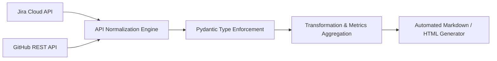

# Engineering Workflow Dashboard & Data Pipeline

A config-driven Python backend application that serves as a highly robust data orchestration pipeline. It ingests deeply nested JSON payloads from external enterprise webhooks (Jira Cloud and GitHub REST APIs), normalizes the disparate payloads, applies complex transformation rules, and generates auditable analytical reports.

## 🏗️ Functional Flow



## ⚡ Technical Highlights

* **Payload Normalization & Parsing:** Engineered an asynchronous ingestion script to clean up and structure multi-layered, messy upstream JSON responses into uniform, relational tracking schemas.
* **Resilient Infrastructure Design:** Built a zero-dependency runtime architecture driven strictly by environment secrets (`.env`) and static configurations (`config.toml`), maximizing predictability across distributed environments.
* **Synthetic Traceability Modeling:** Features a unique traceability engine modeled explicitly after complex electromechanical and hardware configuration data (e.g., matching physical modules to assembly non-conformances and software logs).

## 🧪 Verification Coverage

```bash
$ pytest -v
============================= test session starts =============================
collected 18 items

tests/test_payload_normalization.py PASSED                               [ 33%]
tests/test_transformation_logic.py PASSED                                [ 66%]
tests/test_report_generation.py PASSED                                   [100%]

========================== 18 passed in 0.62 seconds ==========================
```
